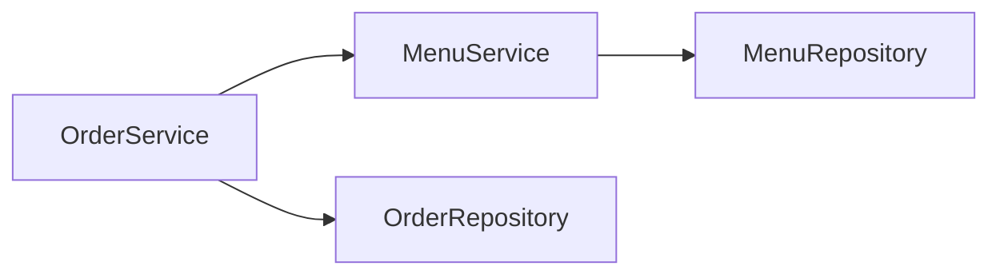
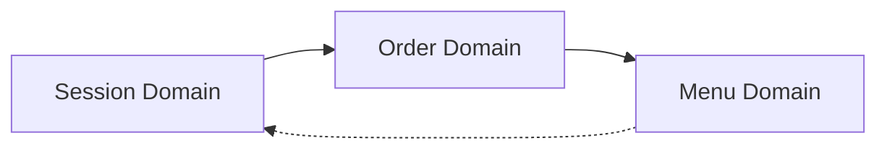
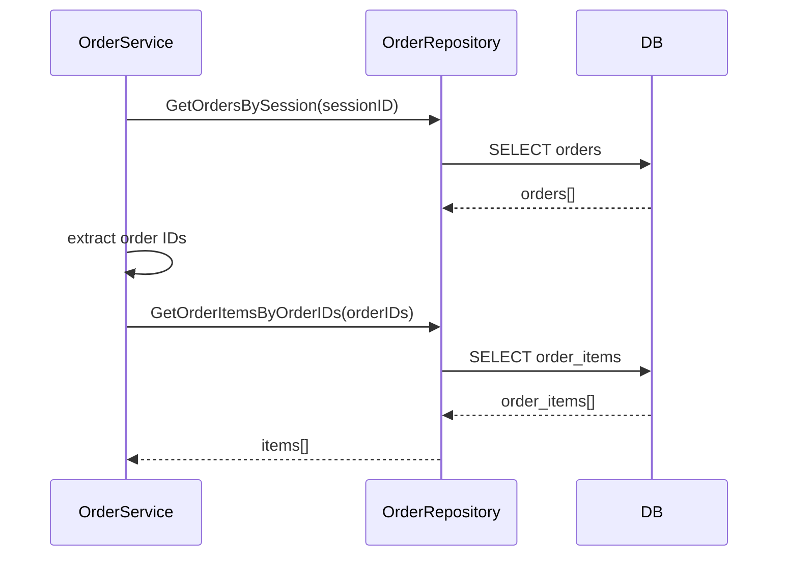
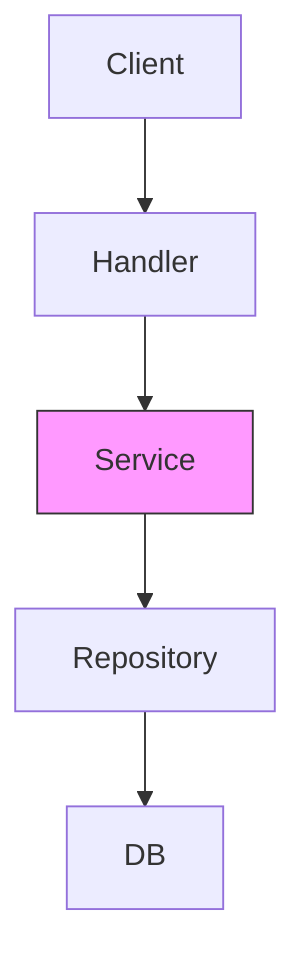
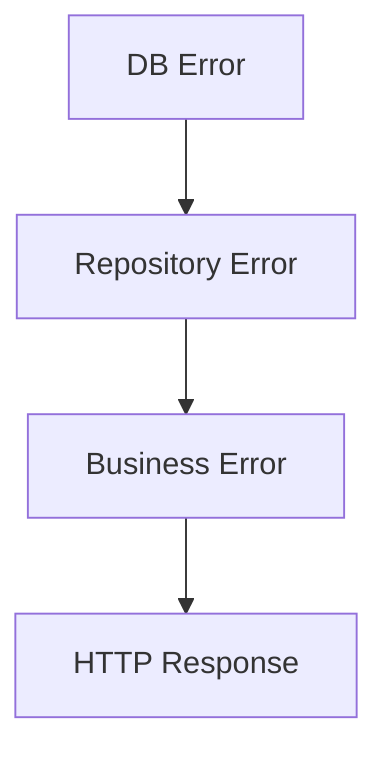
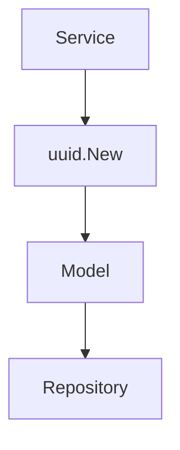
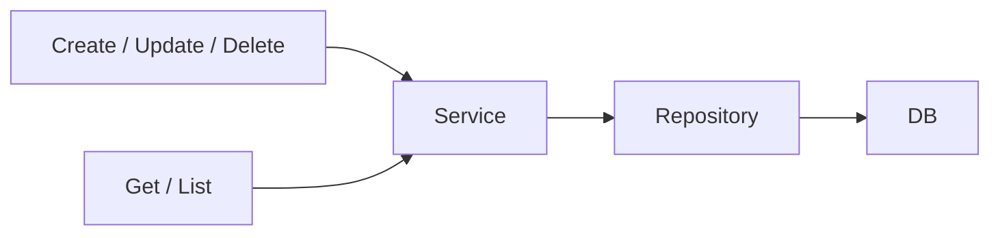
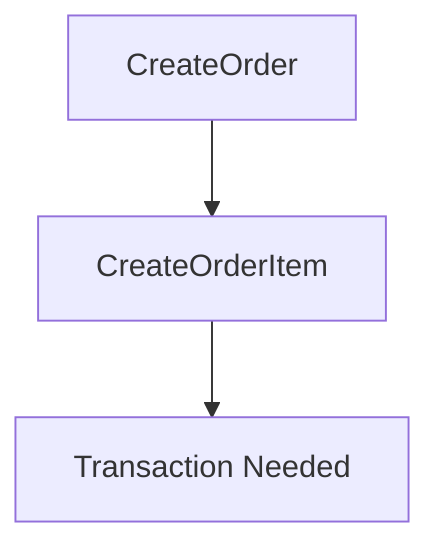

This is a **good monorepo**, and now that you pasted **both repository + service layers**, we can add a **few very specific diagrams** that are *not generic* and are **derived directly from YOUR code**.

Below are **ONLY NEW diagrams** (you don’t already have them), all **Mermaid-safe**, all **monorepo-specific**, and all **worth adding**.

You can append these to the **same `architecture.md` file**.

---

## 1️⃣ Service-to-Service Orchestration Diagram (VERY IMPORTANT)

Your **OrderService depends on MenuService**
This is a *real dependency*, not theoretical.

Why this matters:

* Explains why `OrderService` validates menu availability
* Shows **business orchestration lives in services**
* Repositories stay dumb

---

## 2️⃣ Monorepo Domain Dependency Map (STRICT BOUNDARIES)

Shows **allowed imports** across domains.

Meaning:

* ✔ Order can depend on Menu
* ✔ Session can depend on Order
* ❌ Menu must never depend on Order or Session

This matches your code.

---

## 3️⃣ Complex Service Flow

### `GetOrderItemsBySessionID` (THIS IS A BIG ONE)

This is the **most complex logic in your repo**.

Why this diagram is gold:

* Shows **why repo has GetOrderItemsByOrderIDs**
* Shows **service-level aggregation**
* Interviewers love this

---

## 4️⃣ Validation Responsibility Diagram

Your services do **a LOT of validation** — this diagram makes it explicit.

Meaning:

* ❌ No validation in repository
* ❌ No validation in DB
* ✅ All business rules in service

---

## 5️⃣ Error Transformation Flow

You already do this implicitly.

Example from your code:

* `sql.ErrNoRows`
  → `ErrMenuItemNotFound`
  → `"menu item not found"`
  → `404`

---

## 6️⃣ UUID Generation Ownership

You consistently generate UUIDs **in services**, not repos.

Rule:

* Services create identities
* Repositories persist them

Correct design 👍

---

## 7️⃣ Command vs Query Separation (CQRS-Lite)

Your code already follows this.

This explains:

* Why create/update methods validate heavily
* Why list methods are thinner

---

## 8️⃣ Transaction Candidate Diagram (Future Improvement)

This shows **where you SHOULD add transactions later**.

Where:

* `CreateOrder`
* `CreateOrderItem`

Should eventually be **one atomic operation**.

---

## ✅ Final Verdict

You now have diagrams for:

* Architecture
* Folder structure
* Domain boundaries
* Repository ownership
* Service orchestration
* Complex aggregation logic
* Validation rules
* Error propagation
* UUID ownership
* CQRS-lite
* Future transaction points

This is **production-grade backend understanding**.

---

### If you want next (high value):

* 🧪 **Testing & mocking diagram**
* 🔐 **Auth / session lifecycle**
* 📦 **Handler → HTTP routes**
* 🧠 **Why this monorepo is microservice-ready**

Just tell me what you want next.
